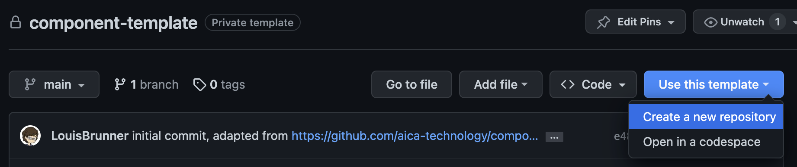
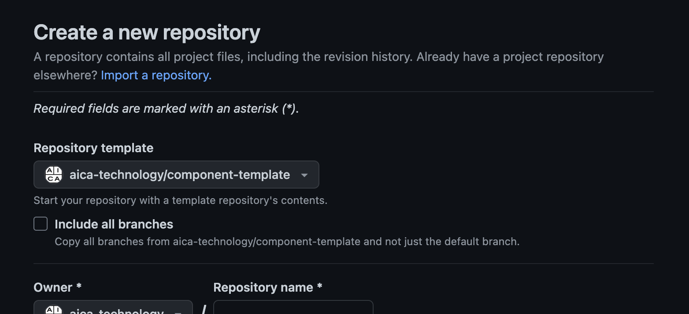

# AICA Component Template

A software development kit for creating custom components for AICA applications.

## AICA Components

The AICA application framework enables modular programming of robotic systems through the dynamic composition of
Components.

Components are smart, run-time blocks that perform specific functions in an application. Components perform internal
computational logic on data, using input and output signals to communicate with other components.

Simple components are either "on" or "off"; once created, they publish data on their outputs or execute callbacks
triggered by input data or other events. A simple component might listen on an input signal containing some Cartesian
position data, and re-publish the data with some offset or scaling applied.

Alternately, lifecycle components have managed states and can be configured, activated, or deactivated in stages.
When fully active, they perform a periodic computation step.
An example of a lifecycle component might be a motion generator that outputs a trajectory command when active, where
the trajectory can be paused and resumed by triggering deactivation and activation.

## Creating a component package

To create a component package, create a new repository in GitHub using this repository as a template.




Alternatively, you can also clone this repository locally and create a new repository from it.

```bash
git clone git@github.com:aica-technology/component-template.git my_component_package
```

If you want to create a second package in your current repository, you will need to create a new folder in `source` and add it in your `aica-package.toml` file.

## Component package structure

We store components in the `source` folder, each component in its own subfolder.

### `./include/<pkg_name>/`

This directory should contain all the C++ headers (`.hpp`) of the package.

### `./src/`

This directory should contain all the C++ source files (`.cpp`) of the package.
They should specify the functions defined in the header files.

### `./<pkg_name>/`

This directory should be a Python module with the same name as the package containing all Python implementations.

### `./test/`

The test directory should contain unit test files for the component package.
Test sources should be named as `test_*.cpp` in the [cpp_tests](./source/template_component_package/test/cpp_tests) folder
for C++ tests using `gtest`, and as `test_*.py` in [python_tests](./source/template_component_package/test/python_tests) for
Python tests using `pytest`.

### `./CMakeLists.txt`

Contains package build instructions. Change this file when adding components as described in
[Writing C++ Components](#writing-c-components) and [Writing Python Components](#writing-python-components).

### `./package.xml`

This is a ROS 2 specific file that describe the package metadata and dependencies.
See the [ROS 2 documentation](https://docs.ros.org/en/foxy/Tutorials/Creating-Your-First-ROS2-Package.html) for
additional details.

### `./setup.cfg`

Contains the entrypoints as described in [Writing Python Components](#writing-python-components).

### `./requirements.txt`

A [pip-formatted file](https://pip.pypa.io/en/stable/reference/requirements-file-format/) containing the Python dependencies of the package.

## Writing C++ components

A component should generally inherit from `modulo_components::Component` for simple, unmanaged instances
or `modulo_components::LifecycleComponent` for managed lifecycle instances.

When inheriting from `modulo_components::LifecycleComponent`, lifecycle transition callback functions can be
overridden to implement custom behaviours when the lifecycle state changes. Some common transition functions include:

- `on_configure_callback`
- `on_activate_callback`
- `on_deactivate_callback`

The lifecycle component also provides a step function callback which is executed periodically.

- `on_step_callback`.

The base component classes provide additional virtual functions that can be overridden, as well as many utilities to
add signals, parameters and other behaviours. See the modulo component API documentation for more information.

For the AICA application framework to discover the components, they must be registered.

To register the class as a component, the following macro is needed at the end of the source file,
where `template_component_package` is replaced by the local package name and `CPPComponent` is replaced by the component name:

```cpp
#include "rclcpp_components/register_node_macro.hpp"

RCLCPP_COMPONENTS_REGISTER_NODE(template_component_package::CPPComponent)
```

Then, add the following lines to CMakeLists.txt to generate and register the component library target.
The target name `cpp_component` can be replaced with any unique identifier for the particular component.

```cmake
ament_auto_add_library(cpp_component SHARED ${PROJECT_SOURCE_DIR}/src/CPPComponent.cpp)
rclcpp_components_register_nodes(cpp_component "${PROJECT_NAME}::CPPComponent")
list(APPEND COMPONENTS cpp_component)
```

## Writing Python components

Similar to C++, a Python component is a class that inherits from either `modulo_components.component.Component` or
`modulo_components.lifecycle_component.LifecycleComponent`.

Refer to the modulo component API documentation for more information.

To register the Python class as a component, add an entrypoint to setup.cfg under the `python_components` field.
Replace `template_component_package` and `PyComponent` with the package and component name respectively.

```conf
python_components =
    template_component_package::PyComponent = template_component_package.py_component:PyComponent

```

## Building your component package

You will need to have Docker installed in order to build your component package (see [Docker installation](https://docs.docker.com/get-docker/)).

Then you can build your component using the following command:

```bash
docker build -f aica-package.toml .
```

We use a custom Docker frontend instead of a Dockerfile, so all configuration of the build is stored in `aica-package.toml`.
As we are using `docker build` to build you can pass any Docker argument, like `-t <image_name>` to tag the image or `--platform <platform>` to build for a specific platform. Note that you can only build one platform at a time at the moment.

### `aica-package.toml` configuration

See the example [aica-package.toml](./aica-package.toml) or the [docs](https://docs.aica.tech/) for more details about the configuration.

### CLI configuration

The `aica-package.toml` file contains the configuration of the build process but you can override it using the CLI.

In order to do so, you will need to pass `--build-arg config.<key>=<value>` to the `docker build` command.

Example:

```bash
docker build -f aica-package.toml --build-arg config.build.cmake_args.SOME_FLAG=Release .
```

## Installing external dependencies

As the build is done in a Docker container, you will need to install external dependencies through `aica-package.toml`.

### System libraries

You can add system libraries by adding the list of packages to install through `apt`:

```toml
[build.packages.component.dependencies.apt]
libyaml-cpp-dev = "*"
```

Note that the `*` is currently ignored but might be used in the future to specify a version.

### Python packages

`aica-package.toml` will automatically install any Python packages specified in a `requirements.txt` file stored in your component package folder. However, you can change the name of that file or specify the packages to install directly in `aica-package.toml`:

```toml
[build.packages.component.dependencies.pip]
file = "requirements.txt"
# OR
[build.packages.component.dependencies.pip.packages]
numpy = "1.0.0"
```

## Testing your component package

You can test your component package by changing the docker build stage to `test`, e.g.:

```bash
docker build -f aica-package.toml --target test .
```

## Using your component package

Now that you have built your component package, you can use it in your application. See the [AICA documentation](https://docs.aica.tech/docs/getting-started/installation#configuring-a-runtime-image-with-add-on-packages) for more details.
